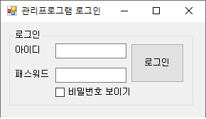
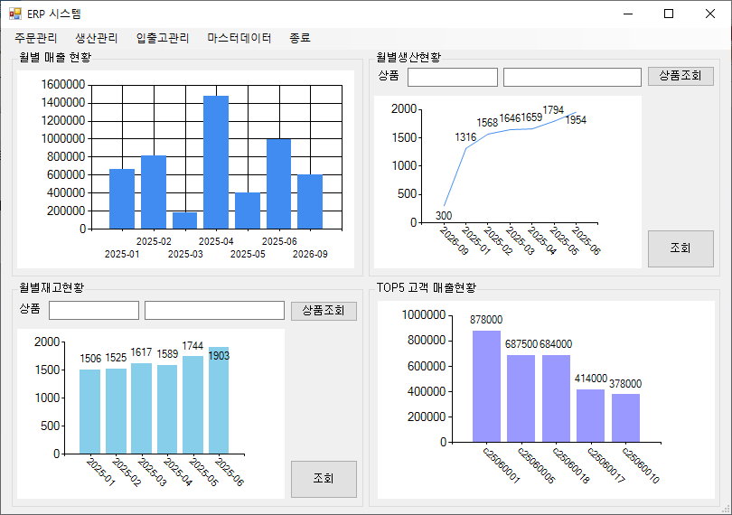
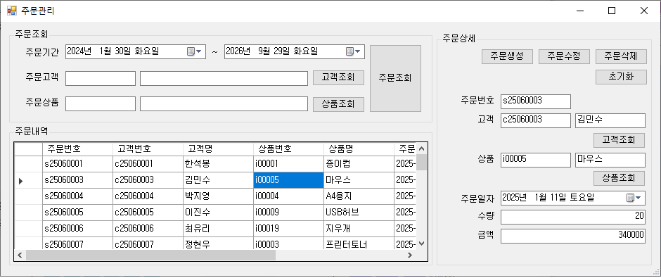
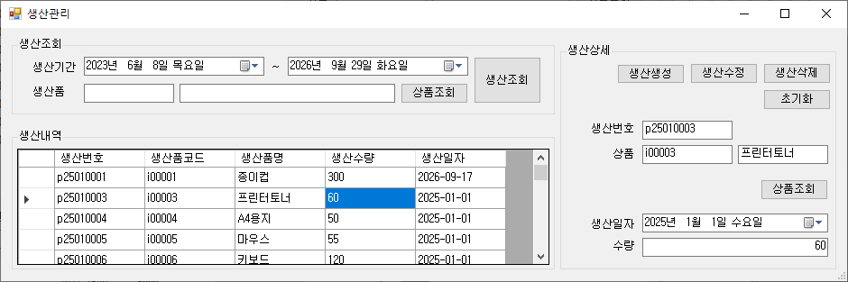
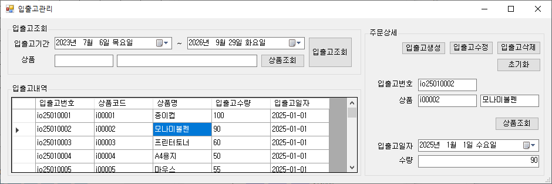
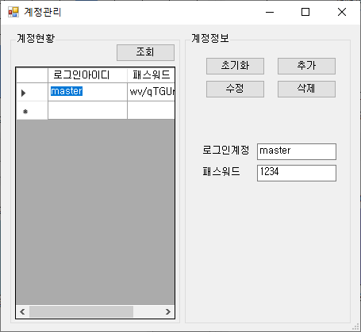
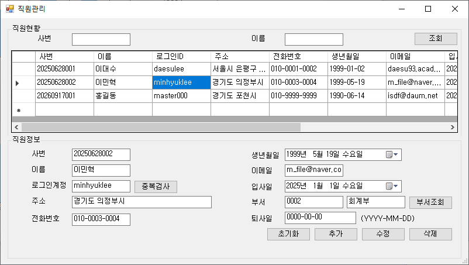
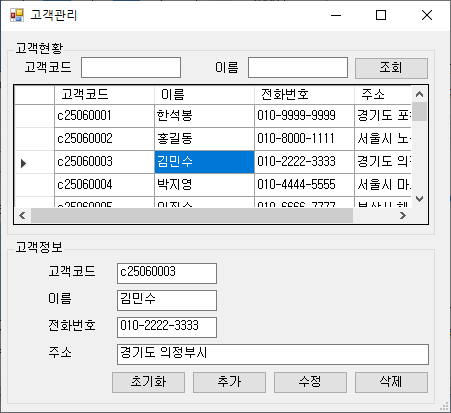
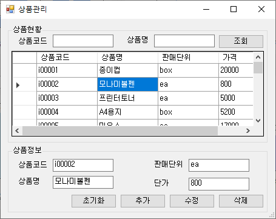

# 📙 앱 소개
 
<h3>🔔 기능 사진 🔔</h3>
  

 
  
<li>로그인화면  
</li>   

<li>메인화면  
</li>   

<li>주문관리  
</li>   

<li>생산관리  
</li>   

<li>입출고관리  
</li>   

<li>계정관리  
</li>   

<li>직원관리  
</li>   

<li>고객관리  
</li>   

<li>상품관리  
</li>   

<li>생산관리  
</li>   

  <h2 style="border-bottom: 1px solid #21262d; color: #c9d1d9;"> Tech Stacks </h2>  
  

    
    
    
    
    
  

